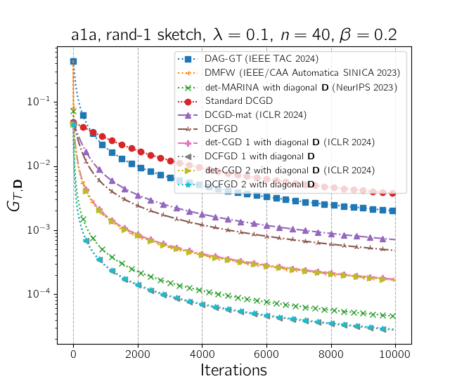
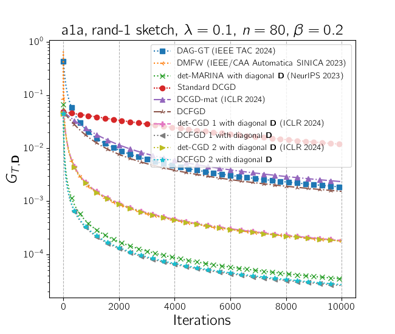
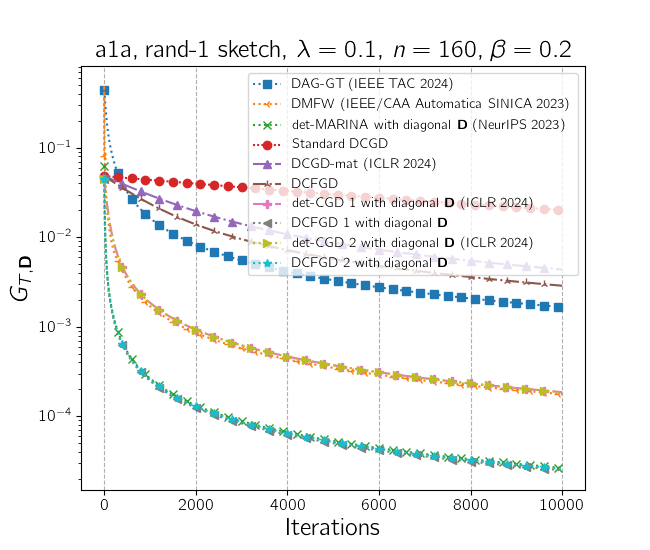
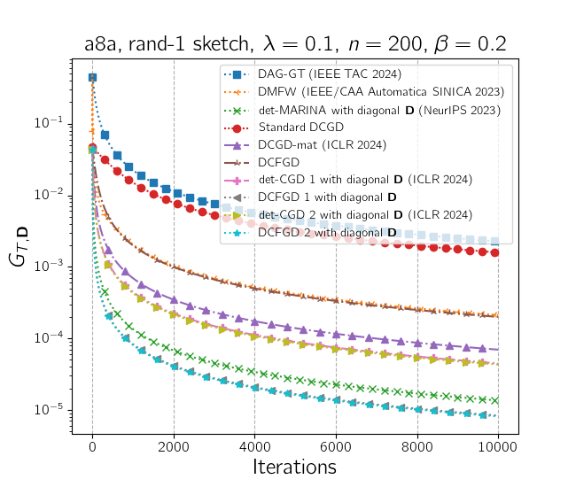
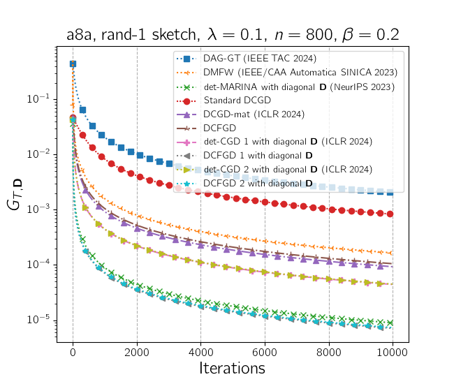
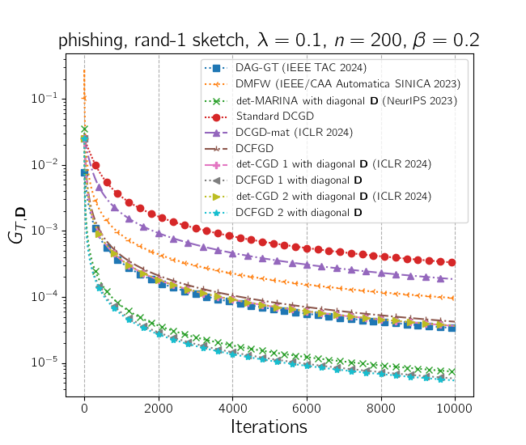
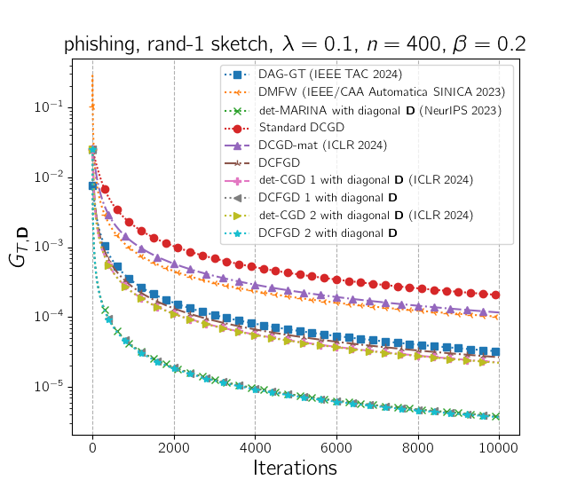
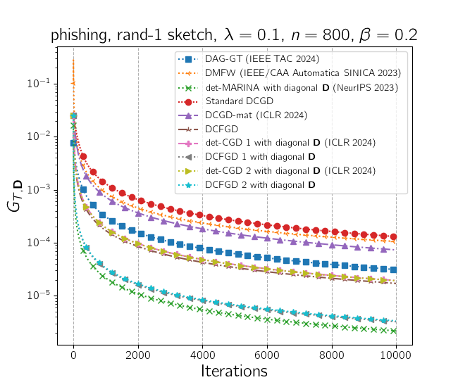

# Fractional Gradient Descent with Matrix Stepsizes for Non-Convex Optimization

### Overview
This repository contains the official implementation of the algorithms proposed in the paper:
> **Fractional Gradient Descent with Matrix Stepsizes for Non-Convex Optimisation**  
> [📄 Read the full paper on TechRxiv](https://www.techrxiv.org/users/883759/articles/1292374-fractional-gradient-descent-with-matrix-stepsizes-for-non-convex-optimisation)
>
> This paper is accepted at IEEE Transactions of Neural Networks and Learning Systems (IEEE TNNLS, IF: 8.9, COre: A*)
> *Authors: Alokendu Mazumder¹, Keshav Vyas², and Punit Rathore¹*  
> *¹Robert Bosch Center for Cyber Physical Systems, Indian Institute of Science, Bengaluru*
> *²Independent Researcher*  
> *Preprint posted on TechRxiv, 2025*

---

## 🚀 Introduction
This work introduces two algorithms:
- **Compressed fractional gradient descent (CFGD) in single node setting.**
- **Distributed Compressed fractional gradient descent (DCFGD) in a distributed/federated node setting.**

Both are novel extensions of Caputo derivative based fractional gradient descent (FGD), designed for non-convex and matrix-smooth optimisation problems. CFGD/DCFGD incorporates **matrix-valued stepsizes** and **compression mechanisms**, allowing efficient large-scale distributed training.

The algorithms extend standard and fractional gradient descent to the distributed and federated learning domains, showing improved convergence and communication efficiency.

---

## 📂 Repository Structure
```
├── cfgd_vs_cgd.py       # Implementation of CFGD and DC(FGD) algorithms
├── plot.py              # Visualization utilities for convergence and comparison
├── figures/             # Folder containing all result figures (9 plots assumed)
│   ├── fig1.png
│   ├── fig2.png
│   ├── fig3.png
│   ├── fig4.png
│   ├── fig5.png
│   ├── fig6.png
│   ├── fig7.png
│   ├── fig8.png
│   └── fig9.png
└── README.md            # Project documentation (this file)
```

---

## ⚙️ Algorithms
The repository implements the following key algorithms:

- **CFGD-1:** Compressed Fractional Gradient Descent with matrix stepsize D applied before compression/sketching.
- **CFGD-2:** Variant where sketching/compression precedes the matrix stepsize operation.
- **DCFGD-1 and DCFGD-2:** Distributed versions of CFGD-1 and CFGD-2 for federated environments.

These are designed to handle both **single-node** and **multi-client distributed setups** efficiently.

---

## 🧠 Key Ideas
- Introduces **matrix-valued stepsizes** to leverage structure in non-convex matrix-smooth objectives.
- Employs **fractional-order gradients (Caputo derivative)** to accelerate convergence.
- Incorporates **communication-efficient sketching/compression** to reduce distributed overhead.
- Demonstrates theoretical **O(1/√T)** convergence for matrix-smooth non-convex functions.
- Provides practical improvements in both iteration and communication complexity compared to standard DCGD, det-CGD (ICLR 2024), DAG-GT (IEEE TAC 2024), DMFW (IEEE/CAA Automatica SINICA 2024), det-MARINA (NeuRIPS 2023).

---

## 🧩 Implementation Highlights
- **cfgd_vs_cgd.py:** Core implementation of CFGD-1, CFGD-2, DCFGD-1, and DCFGD-2.
- **plot.py:** Includes plotting utilities to reproduce convergence plots.
- **experiments.py:** Recreates results for logistic regression tasks in both single-node and distributed settings.
- **utils.py:** Provides general helper functions and reproducibility tools.

---

## 🧪 Experiments
The experiments are divided into two categories:

### 1. Single Node Experiments
- Tests convergence of CFGD-1 and CFGD-2 on logistic regression tasks.
- Compares against vanilla GD, FGD, and DCGD.
- Demonstrates faster convergence when using matrix-valued stepsizes.

### 2. Distributed Experiments
- Evaluates DCFGD-1 and DCFGD-2 in federated setups.
- Compares performance with standard DCGD, det-CGD (ICLR 2024), DAG-GT (IEEE TAC 2024), DMFW (IEEE/CAA Automatica SINICA 2024), det-MARINA (NeuRIPS 2023).
- Shows superior communication and iteration efficiency.

---

## 📈 Results

|  |  |  |
|:----------------------:|:----------------------:|:----------------------:|
|  |  |  |
|  |  |  |

> **Figure 1–9:** Comparison of standard DCGD, DCFGD, det-CGD (ICLR 2024) with optimal diagonal stepsizes under rand-1 sketch, CFGD-1 (Ours) and CFGD-2 (Ours) with optimal diagonal stepsizes under rand-1 sketch, det-MARINA (NeurIPS 2023), DAG-GT (IEEE TAC 2024), and DMFW (IEEE/CAA Automatica SINICA 2024). 

---

## 📚 Citation
If you use this repository or build upon this work, please cite:

```bibtex
@article{mazumder2025fractional,
  title={Fractional Gradient Descent with Matrix Stepsizes for Non-Convex Optimisation},
  author={Mazumder, Alokendu and Vyas, Keshav and Rathore, Punit},
  journal={Authorea Preprints},
  year={2025},
  publisher={Authorea}
}
```

---

## 🙌 Acknowledgements
This research is supported by the Prime Minister's Research Fellowship.


---

## 📬 Contact
For questions or collaborations, please contact:
- **Alokendu Mazumder** — alokendum@iisc.ac.in
- **Punit Rathore** — prathore@iisc.ac.in

---

> *This code accompanies the paper "Fractional Gradient Descent with Matrix Stepsizes for Non-Convex Optimisation" (TechRxiv Preprint, 2025).*

